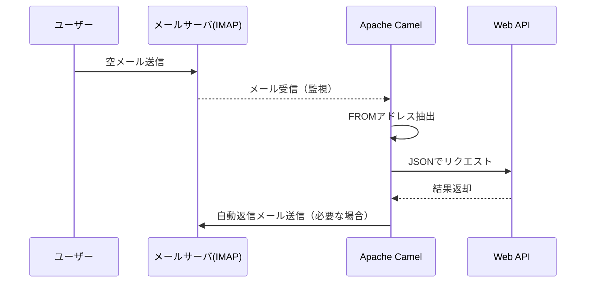
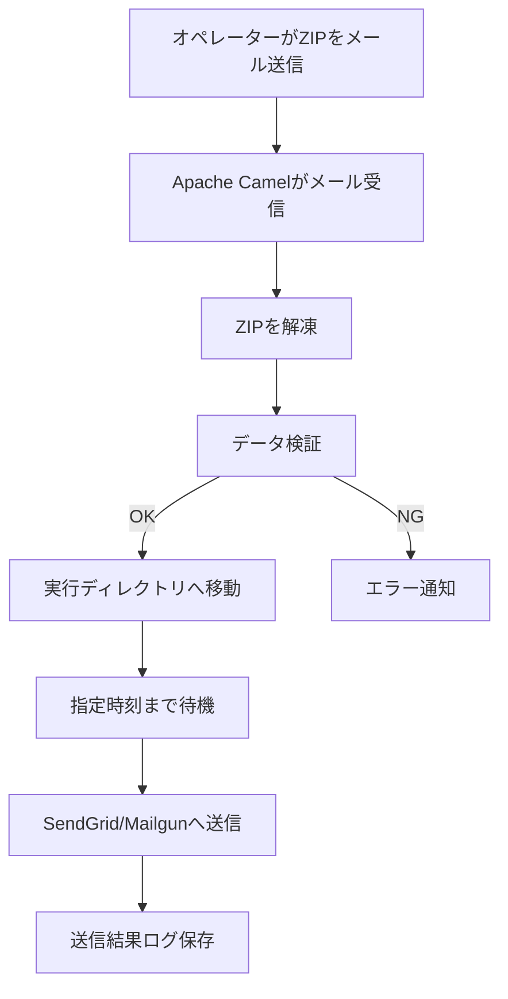

# Project Showcase

実際の企業名・固有名詞は非公開としています。

---

## Linux サーバ構築について（全般）
**期間:** 2008〜現在  
**技術:** Linux / Apache / MySQL / NFS / Lsyncd / Rsyncd / Postfix / Ansible

### 概要
- 長い期間、複数のプロジェクトでLinuxサーバの構築を行ってきました。
- 中小規模のプロジェクトがメインですが、Cloudサーバを２台以上用意して必ずバックアップサーバを用意します。
- ファイルはLsyncdとRsyncを組み合わせ、ファイルをアップすると自動で検知し、sshで暗号化した上で準同期でバックアップします。
- データベースはレプリケーションを用い、SSLで暗号化接続して準同期でバックアップします。
- 完全同期ではありませんが、更新後に即同期が実行され、万が一の故障に備えます。
- 構築にはAnsibleを用い、作業ミスを軽減するようにしています。
- 他にもPostfixを用いたメールサーバ構築の経験もあります。
--※近年はメンテナンスコスト軽減のため、外部のメールサーバを利用するケースが増えています

---

## 仮想化技術について（全般）
**期間:** 2008〜現在  
**技術:** Linux / KVM / VirtualBox / Vagrant / Docker

### 概要
- 出来るだけ本番に環境を近づけるため、ローカルの開発環境に仮想化技術を使用しています。
- Ansbileを用いたサーバ構築にはVagrant(Virtual Box)やKVM
- プログラムの動作確認や本番稼働後の設定変更検証のためにKVMの仮想マシンを用意しています。
- 近年はDockerを用いてレガシーな社内向けWEBを最新のサーバで動作させました。
--通常古いバージョンで開発したプログラムを最新のサーバで動かすにはソースコードを修正しなくてはなりませんが、Dockerによりほぼそのままで動作させることに成功しています。
--※セキュリティーについてはApacheにより、アクセスの制限を掛けています。

---

## メール会員システム
**期間:** 2024〜現在  
**技術:** PHP(CodeIgniter) / JavaScript / BootStrap / MySQL / Linux / Apache / Java (ApacheCamel) 

### 概要
- 店舗やイベント利用を前提としたメール会員システム。
- 取得したメールアドレスにDMを送信したり、ログインにメール認証に利用できます
- QRコードから空メールもしくはフォーム入力でメールアドレスを入力、その他利用者情報はメールアドレス検証後に入力させる仕組み
- 会員は専用ページで会員証のQRを表示したり、会員限定の情報を閲覧したりすることができます。
- メール認証の流れ
-- メールアドレスにワンタイムチケット付きのURLを送信し、届いたメールに書かれたURLをクリックすることで認証きる。認証自体はCookieを使用することとし、できるだけ長期間（１ヶ月とか）維持できるようにしたい。

### 役割
- API 設計・実装
- サーバ運用  

---

## 空メール自動応答
**技術:** Java（Apache Camel） / IMAP
**期間:** 2024〜現在  

### 概要
- メンバーから送信されたメールを自動で受信し、宛先毎に設定した処理を受信したFROM アドレスを元に Web API に処理を要求するプログラムです。
- QRコード作成時にmailtoのSubjectにメール会員の識別コードを設定することで、メール会員システムに事前に登録した情報を突合することもできます。
- 複数のメールアドレスを監視、受信後それぞれに設定したアクションを実行することができます。
- すべてのルート定義は Apache Camel によって記述され、拡張性と保守性を重視しています。

### 役割
- API 設計・実装
- サーバ運用  

---

## メルマガ送信プログラム
**技術:** Java（Apache Camel） / IMAP / Mailgun / SendGrid  
**期間:** 2024〜現在  

### 概要
- メンバーのメールアドレスを記載したCSVを元に、指定した日時にMailgunもしくはSendGridを利用してメールを送信するプログラムです。
- オペレータはルールに則った登録パッケージをZIPでメールに添付して送るだけの簡単操作です。
- 以下の処理を自動化しています。
-- ZIPで圧縮した登録パッケージをメールで受信、解析
-- データに問題なければ実行ディレクトリに移動（キャンセル可能）
-- 指定時刻にメールを配信 
- すべてのルート定義は Apache Camel によって記述され、拡張性と保守性を重視しています。

### 役割
- API 設計・実装
- サーバ運用

---

## 多言語対応 貿易サイト
**技術:** Wordpress / PHP（CodeIgniter） / JavaScript / Linux / MariaDB / Apache / Ansible

### 概要
- 多言語対応の貿易サイトをWordpressをベースに構築しました。
- テーマにはNeve、ショッピングカートにWooCommerceを使用しました
- 英、日の多言語化にはWPMLを使用しています
- 決済にPaypalとStripe導入しました。  
- Ansibleを使った構築で、バックアップスタンバイしているサーバに対し、データの非同期、データベースのレプリケーションをします。

### 役割
- API 設計・実装
- サーバ運用  

---

## 多言語対応 デジタルデータ販売サイト
**技術:** Concrete5 / PHP（CodeIgniter） / JavaScript / Linux / MariaDB / Apache / Ansible

### 概要
- デジタルデータのダウンロードサイトを構築しました。
- Concrete5をCMSとして利用し、日、英、中の多言語化・HTMLデザインをテーマ適用まで行いました
- サイトはJavaScriptで、JSON-RPCを使い、Web Apiと通信して動作します。  
- デジタルデータはメタデータを生成する外部プログラムを実行し、本データとメタデータを合成してダウンロードする仕掛けです。
- 決済にPaypal、課金ゲートウェイを使ってAlipayも導入しました。  
- バックアップスタンバイしているサーバに対し、データの非同期、データベースのレプリケーションをします。
- Ansibleを使った構築で、バックアップスタンバイしているサーバに対し、データの非同期、データベースのレプリケーションをします。

### 役割
- API 設計・実装
- サーバ運用  
- 外部エンジニア（国内・中国）との協業  

---

## Redmineを利用した問い合わせシステム
**技術:** Redmine / helpdesk plugin / Postfix / PHP（CodeIgniter）

### 概要
- Redmineは通常は開発などに使われるチケット管理のオープンソースです。
- ステータスやワークフローなどを自由に設定することができ、helpdeskのプラグインを入れると問い合わせシステムとして活用できます。
- インストールから設定、メールサーバとの連携など一連の構築を行い、現在も運用で使っていただいてます。
- 以下のような仕組みです。
-- サービスサイトのフォームから入力して頂いた内容をチケットに登録します。
-- 通常は開発などに使われるチケット管理システムのRedmineを用い、問い合わせシステムを構築しました
-- helpdeskプラグインを組み込んで、
-- お客様にはメールで自動応答のメッセージが送信されます。
-- Redmineのチケットから入力すると、お客様にメールを送信することができ、お客様の返信もチケットに反映されます。
- メーリングリストで問い合わせ対応をするのと違い、お問い合わせの状態を管理できますので複数人のオペレーションにも対応できます。

---

## 会社のWEBサーバを便利につかう
**技術:** Concrete5/ Nextcloud / Redmine / Squid / Subversion / Git

### 概要
- 会社のHPを置くために借りているCloudサーバですが、それだけではもったいないので色々なアプリケーションを入れて便利にしています。
- 万が一に備えてリアルタイムにバックアップも実施してホットスタンバイしています
- Concrete5
-- 会社のHPを置いてます。CMSなので編集が便利です。デザインは有料のサイトで購入してテンプレート化しました
- Redmine
-- チケット管理システムです。プロジェクトの管理に使ってます
-- 外部エンジニアとのやり取りに欠かせません。
-- プロジェクト毎にWikiも作れるので、情報共有にも便利ですね
- Subversion / Git
--ソース管理に使用しています。
-- 暗号化し、アカウントのアクセス制限を掛けて公開しています。
-- 外部エンジニアとのやり取りに欠かせません
- Nextcloud
-- ストレージサービスとして使用しています。
-- Linuxも使用できるマルチプラットフォームですので便利です。
-- MicrosoftやGoogleのサービスも使用していますが、デスクトップにLinuxを利用しているので、メインのストレージとして利用しています
- Squid（プロキシ）
-- 社内メンバーのみ使用できるアカウント制限付きのプロキシです
-- 業務上IPアドレス制限が必要なサイトにアクセスする際に使用しています。

---

